<h1 align="center">Hi 👋, I'm Luciano Santa Cruz</h1>
<h3 align="center">Full Stack Developer from Argentina</h3>

  

<!-- Trophy card: pending self-hosted Vercel instance. Add back once you have your own domain:

  

-->

- 📫 How to reach me **lucho.lsc46@gmail.com**
- 🌐 Portfolio: **[lucho-39.github.io](https://lucho-39.github.io/)**

<h3 align="left">Connect with me:</h3>

<h3 align="left">Featured Projects:</h3>

**[🍽️ Recetario IA](https://github.com/lucho-39/sdd-recetas)** — Recipe management PWA: unified search across name, ingredients, categories and tags; favorites and collections; fractional-star reviews; and a fullscreen cooking mode with wake lock, voice commands and timers. Real-time notifications, a separate admin panel with dashboard, metrics and audit log, and AI recipe generation from a list of ingredients.

`SvelteKit 2` · `Svelte 5 runes` · `TypeScript` · `FastAPI` · `PostgreSQL` · `Podman`

**[📦 Order Management System](https://github.com/lucho-39/sistema-gestion-pedidos)** — Order and inventory management for an electrical supplies business: products, customers, orders, weekly automated reports, and Excel import/export.

`Next.js 15` · `React 19` · `TypeScript` · `Tailwind CSS` · `shadcn/ui` · `Supabase (Postgres)` · `Vitest`

[**Live demo →**](https://v0-sistema-gestion-pedidos.vercel.app/login)

**[🔧 Punto Ferretero](https://github.com/lucho-39/punto-ferretero-front)** — Product platform for a hardware store. REST API backend with relational data modeling in MySQL, plus a deployable frontend consuming it.

`Python` · `Flask` · `MySQL` · `REST API` · `JavaScript`

[Backend](https://github.com/lucho-39/punto-ferretero-back) · [Frontend](https://github.com/lucho-39/punto-ferretero-front) · [**Live demo →**](https://punto-ferretero-front.vercel.app)

**[🌐 Portfolio](https://lucho-39.github.io/)** — My personal site: projects, background and contact.

`Next.js` · `TypeScript` · `Tailwind CSS`

[**Live site →**](https://lucho-39.github.io/)

<h3 align="left">Languages and Tools:</h3>

                   

